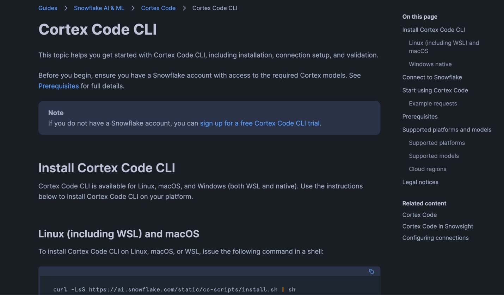
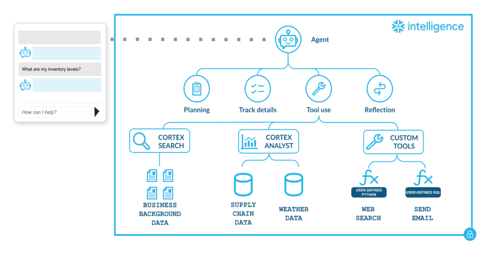
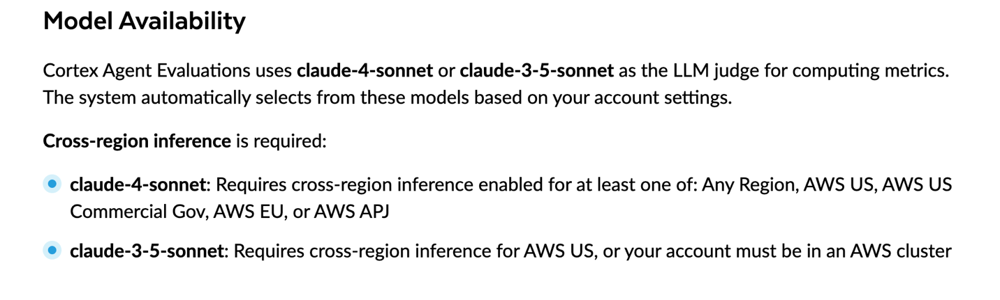
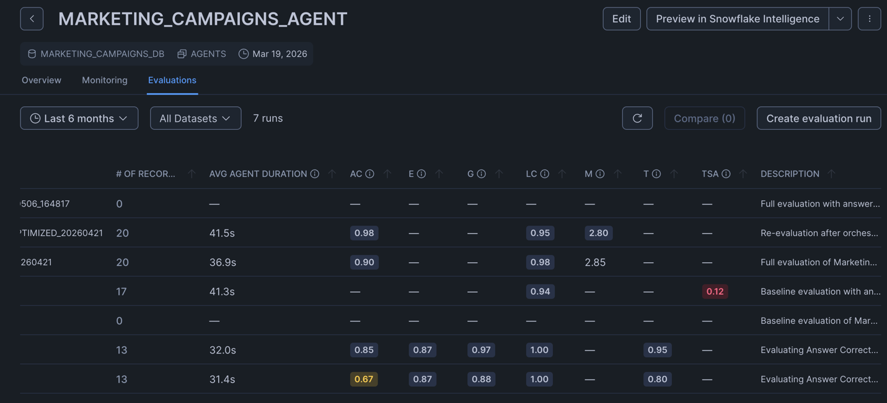

# Agent Evaluation: Monitor, Measure and Improve your AI Agents

Cortex Agent evaluations allow you to monitor your agent's behaviour and performance. Evaluate your agent against both ground truth and reference-free evaluation metrics. During evaluation, your agent's activity is traced and monitored so you can ensure that each step in the process advances towards your end goal.

Users can evaluate their agent via Snowsight UI, SQL or via Cortex Code CLI. We will use Cortex Code CLI for this hands-on session.

---

## Session 1: Pre-requisites

### Install Cortex Code CLI

https://docs.snowflake.com/en/user-guide/cortex-code/cortex-code-cli



### Read Cortex Agent Best Practices

https://www.snowflake.com/en/developers/guides/best-practices-to-building-cortex-agents/



### Ensure you have access to Claude -4 Sonnet (at the very least 3-5)



### Ensure you have the appropriate privileges

Including Account-level, Agent Database and Schema, Agent Object, Evaluation Data (if different from agent database/schema), stage and warehouse.

**Account-Level**
```sql
GRANT DATABASE ROLE SNOWFLAKE.CORTEX_USER TO ROLE <role>;
GRANT EXECUTE TASK ON ACCOUNT TO ROLE <role>;
```

**Agent Database & Schema**
```sql
GRANT USAGE ON DATABASE <agent_db> TO ROLE <role>;
GRANT USAGE ON SCHEMA <agent_db>.<agent_schema> TO ROLE <role>;
GRANT CREATE FILE FORMAT ON SCHEMA <agent_db>.<agent_schema> TO ROLE <role>;
GRANT CREATE TASK ON SCHEMA <agent_db>.<agent_schema> TO ROLE <role>;
```

**Agent Object**
```sql
GRANT USAGE ON AGENT <agent_db>.<agent_schema>.<agent_name> TO ROLE <role>;
GRANT MONITOR ON AGENT <agent_db>.<agent_schema>.<agent_name> TO ROLE <role>;
```

**Eval Data (if different from agent database/schema)**
```sql
GRANT USAGE ON DATABASE <data_db> TO ROLE <role>;
GRANT USAGE ON SCHEMA <data_db>.<data_schema> TO ROLE <role>;
GRANT EXECUTE TASK ON SCHEMA <data_db>.<data_schema> TO ROLE <role>;
GRANT CREATE DATASET ON SCHEMA <data_db>.<data_schema> TO ROLE <role>;  -- only if registering a new dataset
```

**Stage & Warehouse**
```sql
GRANT READ ON STAGE <agent_db>.<agent_schema>.<stage_name> TO ROLE <role>;  -- if stage already exists
GRANT USAGE ON WAREHOUSE <warehouse> TO ROLE <role>;
```

---

## Session 2: Prompts For Agent Evaluation

### Step 1: Create or Use an Existing Agent

If you already have a live agent, skip step 1. If not, create a dummy agent (this is just an example. Define your own database, schema and agent name):

```
I am setting up a Cortex evaluation workshop. I need you to create a retail-themed Cortex agent at AGENT_RLS.PUBLIC.RETAIL_AGENT that I can use for evaluation exercises.

Create sample retail tables in the AGENT_RLS database with realistic data:
- A sales/orders table (order_id, customer_id, product_id, quantity, revenue, order_date, region, channel)
- A products table (product_id, product_name, category, subcategory, unit_price, cost)
- A customers table (customer_id, customer_name, segment, region, join_date)

Create a semantic view named AGENT_RLS.PUBLIC.RETAIL_ANALYTICS_VIEW over these tables with:
- Dimensions: region, channel, category, subcategory, customer segment, product name, date dimensions
- Metrics: total revenue, total orders, average order value, units sold, gross margin
- A few verified query representations (VQRs) for common retail questions

Create a Cortex agent named AGENT_RLS.PUBLIC.RETAIL_AGENT using that semantic view as a cortex_analyst_text_to_sql tool. The agent should be able to answer questions about sales performance, product trends, customer behavior, and regional analysis. Use my active Snowflake connection. Create a warehouse if needed or use an existing one.
```

### Step 2: List Agents

```
List all agents available in my deployment
```

### Step 3: Create an Evaluation Dataset

```
Create an evaluation dataset for my agent AGENT_RLS.PUBLIC.RETAIL_AGENT
Design from scratch
```

### Step 4: Create a Cortex Agent Evaluation

```
Create a Cortex agent evaluation on the agent AGENT_RLS.PUBLIC.RETAIL_AGENT
```

Available metrics:
- **answer_correctness** — Does the agent give correct answers? (requires ground truth)
- **logical_consistency** — Is the response internally consistent? (no ground truth needed)
- **Custom metric** — Define your own LLM-judged metric with a prompt and score range

Select metrics (e.g., "1,2" or "all" or "just 2")

### Step 5: Add a Custom Metric

```
Add a custom metric
What score range should this custom metric use?
```

### Step 6: Optimize the Agent

```
Optimize the agent AGENT_RLS.PUBLIC.RETAIL_AGENT and show a side by side comparison with baseline
```

### Step 7: Navigate to the UI

Navigate to the UI to see your evals (Result might take 5-10 min to come up)



### Step 8: Generate Reports

```
Generate reports using Cortex Code skill agent-observability-report
```

---

## Session 3: Best Practices to Operationalise and Automate Your Agent Evaluation

### Source Controlling Your Agent Evaluation

Before setting up CI/CD, store your agent artifacts in version control:

- Agent specification YAML (instructions, tool descriptions, orchestration configs)
- Semantic View YAML (tables, metrics, relationships, verified queries)
- Evaluation configuration YAML (metrics, dataset references, custom metric prompts)
- Evaluation dataset definitions (or references to registered Snowflake datasets)

Git history provides an audit trail of every agent change, and pull requests provide code review before any modification reaches a shared environment.

### Automating Agent Evaluations

A typical GitHub Actions pipeline:

1. A developer opens a PR that modifies the agent spec
2. The CI workflow deploys the candidate spec to a staging agent
3. The workflow uploads the eval config YAML to a Snowflake stage and starts an evaluation run
4. The workflow polls until the evaluation completes, then retrieves results
5. A quality gate checks whether metrics meet your thresholds (e.g., answer_correctness >= 0.75)
6. If the gate passes, the PR is allowed to merge. If it fails, the PR is blocked and the developer can inspect the evaluation results to understand what regressed

Consider using progressive thresholds across environments: lenient and advisory in dev to avoid blocking experimentation, stricter hard gates in QA, and the highest thresholds in production paired with automatic rollback on failure. Set thresholds based on observed baselines from multiple eval runs rather than aspirational targets — thresholds set too aggressively create flaky gates that erode trust in the pipeline.

### Tips for CI/CD with Agent Evaluations

- **Pin the orchestration LLM**: Use a specific model (e.g., claude-4-sonnet) rather than auto. This ensures CI results are reproducible and not affected by model rotation.
- **Use a dedicated warehouse and role**: Run CI evaluation jobs under a service role with a dedicated warehouse to avoid contention and simplify cost tracking.
- **Version your eval datasets**: Keep evaluation datasets in version control alongside the agent spec, or reference a registered Snowflake dataset by name. This ensures the same dataset is used across all pipeline runs.
- **Budget for LLM judge costs**: Each evaluation run invokes CORTEX.COMPLETE for every metric on every question in your dataset. For a 20-question dataset with 3 metrics, that is 60 LLM judge calls per run.
- **Combine CI/CD with scheduled testing**: CI/CD evaluations guard against regressions from agent configuration changes. Cadence-based scheduled testing (covered next) catches regressions from external factors such as model updates, data changes, or tool configuration drift. Both are necessary for comprehensive quality assurance.

---

## Session 4: Deploying to Production

Depending on your confidence in your eval set and the stakes of your use case, you can choose a deployment strategy. In all cases, agent versioning is what makes safe deployment possible.

### Versioning Model

Cortex Agent versioning gives you a clean separation between development and production:

- **Live version** → where you iterate, test, and break things
- **Named versions** → immutable snapshots you can safely deploy
- **Aliases** (e.g. production, staging) → how you route traffic

### Deployment Flow

**1. Develop on the live version**

Iterate on prompts, tools, and configs. Test interactively or against evals.

**2. Commit to create a production candidate**

This creates a new immutable version (e.g. VERSION$4):

```sql
ALTER AGENT my_agent COMMIT
COMMENT = 'Improved retrieval + tool usage';
```

**3. Test the new version explicitly**

Run evals against VERSION$4. Optionally route internal traffic to it via a staging alias.

**4. Promote the agent to production**

All traffic pointing at production now uses the new version:

```sql
ALTER AGENT my_agent
MODIFY VERSION VERSION$4 SET ALIAS = production;
```

**5. Rollback instantly if needed**

```sql
ALTER AGENT my_agent
MODIFY VERSION VERSION$3 SET ALIAS = production;
```

This alias-based routing is what enables safe, reversible deployments.

---

## Session 5: Setting Up Alerts

Alerts can monitor metrics of interest from Snowflake agent observability event logs. Below are examples for evaluation accuracy, latency, reliability, and user feedback thresholds.

First, create a notification integration (one-time setup):

```sql
CREATE OR REPLACE NOTIFICATION INTEGRATION my_email_int
TYPE = EMAIL
ENABLED = TRUE
ALLOWED_RECIPIENTS = ('admin@example.com');
```

Agent evaluation threshold alert:

```sql
CREATE OR REPLACE ALERT agent_eval_threshold_alert
WAREHOUSE = my_warehouse
SCHEDULE = '1 HOUR'
IF (EXISTS (
  SELECT *
  FROM TABLE(SNOWFLAKE.LOCAL.GET_AI_EVALUATION_DATA(
    'my_db',        -- database
    'my_schema',    -- schema
    'my_agent',     -- agent name
    'CORTEX AGENT', -- agent type
    'my_run'        -- evaluation run name
  ))
  WHERE METRIC_NAME = 'answer_correctness'
  AND EVAL_AGG_SCORE < 0.7  -- threshold: 70% accuracy
))
THEN
  CALL SYSTEM$SEND_SNOWFLAKE_NOTIFICATION(
    SNOWFLAKE.NOTIFICATION.TEXT_PLAIN(
      'Agent evaluation accuracy dropped below 70% threshold.'
    ),
    '{"my_email_int": {"toAddress": ["admin@example.com"]}}'
  );
```

---

## Session 6: Relevant Skills

- Dataset-curation skill
- Evaluation skill
- Optimization skill
- Agent-observability-report

---

## Session 7: Relevant Links

- [Agent Evaluation Best Practices](https://www.snowflake.com/en/developers/guides/best-practices-for-evaluating-cortex-agents/)
- [Cortex Agent Versioning](https://docs.snowflake.com/en/user-guide/snowflake-cortex/cortex-agents-versioning)
- [Getting Started with Agent Evaluation](https://www.snowflake.com/en/developers/guides/getting-started-with-cortex-agent-evaluations/)
- [Best Practices for Building Cortex Agents](https://www.snowflake.com/en/developers/guides/best-practices-to-building-cortex-agents/)
